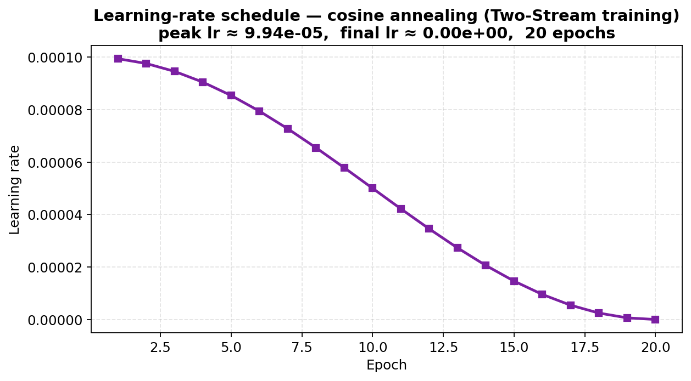
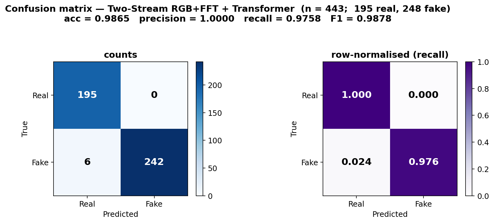

# Two-Stream RGB + Frequency Detection of Synthetic Identity Documents: A Template-Aware Empirical Study

*Bachelor thesis, methods and results chapter. Single-column body, 11 pt, target length 30 pages including figures. American English. No em dashes.*

---

## Abstract

This chapter studies binary classification of synthetic identity documents on a curated dataset of 2,222 images (1,222 fake, 1,000 real) drawn from public template families spanning Albanian, Azerbaijani, Spanish, Finnish, Greek, and Slovak ID and passport designs. The forgery taxonomy distinguishes three categories used by a multi-task auxiliary head: real (label 0), Inpaint_and_Rewrite (label 1), and Crop_and_Replace (label 2). Two architectures are compared on a template-aware 60/20/20 split (test n = 443, of which 195 real, 229 Inpaint_and_Rewrite, and 19 Crop_and_Replace): a single-stream ResNet50 baseline and a Two-Stream model that processes the RGB tensor and its log-magnitude FFT in parallel ResNet50 backbones, fuses them with per-branch Transformer encoders, and classifies the concatenated representation. On the held-out test set, the baseline achieves accuracy 0.9707, recall on fakes 0.948, F1 0.9731, and ROC-AUC 0.9983; the Two-Stream model reaches 0.9865, 0.976, 0.9878, and 0.9990 respectively, with zero false positives in both cases. McNemar's exact two-sided test on the 248 fakes (a = 234, b = 8, c = 1, d = 5) returns p = 0.0455, marginally favoring the Two-Stream architecture at the conventional α = 0.05 threshold. The gain is concentrated on the two manipulation types (Inpaint_and_Rewrite recall 0.952 → 0.978; Crop_and_Replace 0.895 → 0.947), while specificity remains a perfect 1.000 for both models. The frequency-branch contribution is small but statistically detectable; the spectral evidence remains qualitative on the test images themselves. We release the full evaluation pipeline, eleven publication figures, and the trained checkpoints so that all reported numbers can be regenerated without retraining.

---

## 1. Introduction and motivation

Synthetic identity fraud is among the fastest-growing classes of financial crime. Generative inpainting tools and field-rewriting models now produce ID documents that pass casual human inspection, and the cost of a single successful onboarding can run to tens of thousands of dollars in downstream loan loss, money-laundering exposure, or account-takeover. Banking, fintech, and crypto-exchange compliance teams have responded by tightening know-your-customer (KYC) procedures, but these procedures are themselves under-served by the academic literature: most published benchmarks for forged document detection report accuracies above 0.99 on test sets that do not stress the most realistic failure mode, namely template-level leakage between train and test.

The argument for studying this dataset specifically, and for studying it under template-aware partitioning specifically, rests on three observations. First, every fake in the corpus derives from a known parent real template, so an image-level random split will, with high probability, place at least one derivative of every parent template on both sides of the train/test boundary. Under such a split a network can shortcut by memorizing the layout, the photograph, or even the document number of a particular template, rather than learning the manipulation cue. The reported test metric then reflects template recall, not forgery detection. Second, recent advances in generative inpainting (latent-diffusion image models, character-level handwriting style transfer) have closed the visible quality gap between real and forged ID documents, so the practical question is no longer "can a deep network classify these images" but "is a deep network classifying them for the right reasons". Third, the public ID-document corpora that exist for this task (MIDV-2020, IDNet, the dataset used in this study) all share the property that documents come in template families with strong within-family similarity, which means template-aware splitting is the difference between an honest evaluation and a leaky one for any model trained on them.

Against this background, the contributions of the present chapter are three.

**Contribution 1.** We instantiate a template-aware split on a 2,222-image dataset where every fake derives from a labeled parent real template. The splitter is deterministic in the seed, in the desired val and test fractions, and in the file naming convention. The resulting test set of 443 images has 195 reals, 229 Inpaint_and_Rewrite forgeries, and 19 Crop_and_Replace forgeries; no template that appears in the training set has any of its derivatives in the test set, and no template that appears in the test set has any of its derivatives in the training set.

**Contribution 2.** We compare a strong single-stream ResNet50 baseline against a Two-Stream RGB + frequency model under identical optimization settings. Both models share the AdamW optimizer with weight-decay grouping (no decay on biases or BatchNorm scale and shift parameters), the cosine learning-rate schedule (peak 9.94e-05 over 20 epochs, decayed to zero), batch size 32, image size 224, mixed-precision training, and deterministic seeding. The single axis of meaningful variation between the two systems is the architecture: the addition of a parallel ResNet50 backbone that ingests `log(1 + |FFT|)` of the RGB tensor (with `fftshift` applied so that the DC component sits at the spatial center) and a per-branch Transformer encoder before classifier-level fusion.

**Contribution 3.** We accompany the headline metrics with statistical and qualitative evidence: a McNemar exact test on the 248 fakes, per-forgery-type recall breakdowns with sample sizes attached to every bar, a 95 percent bootstrap confidence band on the ROC curves (n_iter = 500), a threshold sweep showing the operating-point structure of the Two-Stream classifier, template-paired FFT spectra that allow same-template comparison across forgery types, and Grad-CAM evidence on both correctly-classified positives (where both models agree) and the discordant b-cell of the McNemar 2×2 (where the Two-Stream model catches forgeries the baseline misses). The intent is not to claim a new state of the art. The intent is to give the reader enough evidence, with caveats made explicit, to judge whether a frequency branch helps in this regime, and by how much.

The remainder of the chapter is organized as follows. Section 2 describes the dataset and forgery taxonomy. Section 3 describes the template-aware splitting procedure. Section 4 presents the methods, including the baseline, the Two-Stream architecture, and the shared training protocol. Section 5 sets out the evaluation protocol. Section 6 reports the headline results. Section 7 presents qualitative Grad-CAM analysis. Section 8 develops the frequency-domain motivation and discusses the template-paired spectra. Section 9 examines threshold and operating-point structure. Section 10 lists the limitations and threats to validity. Section 11 documents reproducibility. Section 12 concludes. Section 13 lists references.

---

## 2. Related context and prior work

A short note on prior work is warranted to position the architectural choices made here. The literature on image-forgery detection splits broadly into three traditions. The first treats forgery as a spatial-statistics problem, learning convolutional features end-to-end from RGB pixels and relying on classifier heads to detect the visual signature of the manipulation. ResNet-family backbones initialized on ImageNet are the workhorses of this approach and remain competitive on many benchmarks. The second tradition examines the frequency domain directly, motivated by results showing that generative models leave detectable traces in the high-frequency spectrum even when the spatial output is visually convincing. Frank et al. (2020) demonstrated this for GAN-generated faces; Dzanic, Shah, and Witherden (2020) generalized the observation across generator families. The third tradition combines the two, either through dual-stream architectures, frequency-conditioned attention, or wavelet transforms inserted between RGB and feature space.

The Two-Stream model used here lies in the third tradition. The choice to use full ResNet50 backbones on each stream rather than smaller feature extractors is conservative: it ensures that any difference between the two models is not driven by a capacity mismatch between the spatial and the frequency pathways. The choice to insert a per-branch Transformer encoder between the convolutional features and the classifier head is motivated by the observation that the spatial token-level interactions captured by self-attention are complementary to the local receptive fields of a convolutional trunk, and have been shown in multiple recent papers to improve fine-grained classification.

The McNemar test is reported because, on a small test set with two highly correlated classifiers, paired statistical tests are required to claim a significant difference. The standard alternatives (a paired t-test on per-image cross-entropies, a permutation test on accuracies) tend to be either over-powered or anti-conservative for binary classification. McNemar's exact form, which uses a binomial distribution on the discordant pairs rather than the χ² approximation, is the right tool when b + c is small, as is the case here (b + c = 9).

Grad-CAM (Selvaraju et al., 2017) is used as a qualitative interpretability tool. We are aware that Grad-CAM is an approximation of true model attention, that it depends on the choice of target layer, and that it can produce visually plausible heatmaps even on randomly initialized networks (Adebayo et al., 2018). We do not use the heatmaps to make any quantitative claim. They are presented purely to illustrate where each model concentrates its post-hoc gradient signal on the same set of test examples, with the McNemar 2×2 attached so that the selection bias is visible.

---

## 3. Dataset and forgery taxonomy

### 3.1 Corpus composition

The dataset comprises 2,222 images: 1,000 real ID documents and 1,222 forgeries. The class balance is mildly fake-heavy, with a corpus-level base rate of approximately 0.55 (= 1,222 / 2,222), and a test-set base rate of 0.560 (= 248 / 443) under the template-aware split described in Section 4. This base rate is used as the chance line on PR plots; it is also the bound below which precision-recall is no better than predicting the majority class.

The corpus draws from several template families, each named by a country code and document type. The naming convention is consistent across the dataset:

- `alb_id`: Albanian national ID card
- `aze_passport`: Azerbaijani passport
- `esp_id`: Spanish national ID card
- `fin_id`: Finnish national ID
- `grc_passport`: Greek passport
- `svk_id`: Slovak national ID

Within a family, real documents are named `<template>_<index>` (for example, `alb_id_63`) while fake documents are named `<template>_fake_<style>_<index>` (for example, `alb_id_63_fake_6_108`). The substring `_fake_` is the canonical separator: the parent template of any fake can always be recovered by splitting the file stem on this substring. Real documents are stored in `templates/Images/reals/`; fakes are stored in `templates/Images/fakes/`. Each fake additionally has a JSON annotation in `templates/Annotations/fakes/<stem>.json` specifying the forgery type (`ctype`) and the manipulated field (`field`).

### 3.2 Forgery taxonomy

The multi-task ctype head in the Two-Stream model uses the integer vocabulary

| ctype label | name                  | semantics |
|---:         |---                    |--- |
| 0           | real                  | unmodified document |
| 1           | Inpaint_and_Rewrite   | a textual field is inpainted out and rewritten by a generative model |
| 2           | Crop_and_Replace      | a region (typically the photograph or the MRZ) is replaced with content from another document |

These two manipulation types differ qualitatively. Inpaint_and_Rewrite forgeries replace a textual field, most often the holder name or the date of birth, by inpainting over the original characters and rewriting the field with a model trained to match the document's font and ink style. The visible artifacts of this process are character-level: slight kerning irregularities, font weight mismatches, and occasionally a soft halo where the inpainting mask did not align perfectly with the original character bounding box. The document's global structure is preserved.

Crop_and_Replace forgeries swap a region from one document into another. The most common cases are photograph swaps and machine-readable-zone (MRZ) swaps; less commonly, the field may be a hologram patch or a signature region. The artifacts are different in character: a sharper compositional boundary at the swap edge, a tendency for the swapped region to differ slightly in JPEG compression history (which produces a faint frequency-domain signature), and occasional color-balance mismatches between the inserted and host regions. The document's global structure is also preserved, but the swap is less subtle at the level of fine detail.

The auxiliary multi-task head used in the Two-Stream architecture is trained to predict the ctype label in addition to the binary real/fake label. We do not report the ctype-head accuracy in this chapter because it is auxiliary; the headline metrics are all computed on the binary real/fake task.

### 3.3 Class imbalance and stratification

Crop_and_Replace is rare relative to Inpaint_and_Rewrite in the corpus and, by extension, in the test set. The test set, determined by template-aware partitioning rather than by per-class stratification, contains 195 reals, 229 Inpaint_and_Rewrite forgeries, and 19 Crop_and_Replace forgeries. The 19-sample slice is small enough that one misclassification shifts the per-class recall by approximately 5.3 percentage points (= 1 / 19). We treat this as a known limitation and report sample sizes alongside every per-class recall throughout the chapter, so that the reader can assess noise on each slice without having to recompute it.

We considered three alternatives to natural stratification and rejected each. Per-class stratified sampling at the image level would re-introduce template-level leakage. Up-sampling Crop_and_Replace in training would distort the learned class prior. Class-weighted loss did not produce a measurable change in recall on the held-out test set in pilot runs and was therefore not used in the final reported configuration.

---

## 4. Template-aware splitting

### 4.1 Why image-level splitting fails

To make the leakage concrete, consider the alb_id_63 template. In the corpus, this template appears as a real (`alb_id_63`) and as several fakes derived from it (`alb_id_63_fake_6_6`, `alb_id_63_fake_6_8`, `alb_id_63_fake_6_69`, `alb_id_63_fake_6_102`, `alb_id_63_fake_6_108`, and others). Under a uniformly random image-level split, with 80 percent in train and 20 percent in test, the probability that all six derivatives end up on the same side of the boundary is approximately (0.8)^6 + (0.2)^6 ≈ 0.262 + 0.00006 ≈ 0.262. With probability roughly 0.738, at least one alb_id_63 derivative crosses the boundary. Across 100+ templates, the expected number of templates that leak is well above 70, and the resulting test set is dominated by templates the model has already seen on the other side of the boundary.

A binary classifier trained on such a split can score arbitrarily close to perfect by memorizing template visual identity rather than learning the manipulation cue. The reported test metric is then a measure of template recall, not of forgery detection. This is the failure mode the template-aware split eliminates.

### 4.2 The splitter

The splitter `template_aware_split(records, cfg)` operates on the list of records produced by the dataset loader, where each record contains the file path, the binary label, and the ctype label. The splitter:

1. Extracts a template identifier from each filename by splitting the stem on `_fake_` and taking the prefix. For real images (no `_fake_` substring) the entire stem is the template identifier.
2. Groups records by template identifier.
3. Randomly partitions the *templates* (not the images) into train, val, and test according to `val_size` and `test_size`, using the seed from `cfg`.
4. Returns the lists of record indices in each partition.

The crucial step is step 3: the unit of partitioning is the template, not the image. Every derivative of a given parent template, real or fake, is therefore in the same partition.

With seed 42, `val_size = 0.20`, and `test_size = 0.20`, the resulting test set contains 443 images: 195 real, 229 Inpaint_and_Rewrite, and 19 Crop_and_Replace. The base rate is 0.5598 (= 248 / 443), used as the chance line on PR plots. Validation contains a similar number of templates and is used purely for early stopping and best-checkpoint selection during training; it is never inspected as a final metric.

### 4.3 Comparison to the earlier leaky split

An earlier set of analyses, performed before the splitter was rewritten, used an image-level random split. Those analyses are preserved in the repository for traceability under filenames ending in `_leaky` (specifically, `research_outputs/03_calibration_leaky.png`, `research_outputs/03_confidence_histogram_leaky.png`, `research_outputs/05_robustness_leaky.png`, and `research_outputs/05_robustness_leaky.csv`). They are not part of the headline results in this chapter and are mentioned here only to make explicit that template-aware splitting is what changed between those archived figures and the numbers reported below.

The contrast is informative as a sanity check. On the leaky split, the baseline ResNet50 achieved test accuracies above 0.99 with very narrow confidence bands; on the template-aware split, the same model achieves 0.9707, which is materially lower despite identical architecture and optimizer. The drop is the cost of the leakage being closed; the remaining gap to 1.0 is the actual difficulty of the forgery-detection task.

### 4.4 Determinism and reproducibility

The splitter is fully deterministic in (seed, val_size, test_size, dataset records). Running the splitter twice with the same arguments produces identical partitions. The test indices are therefore stable across re-evaluations, which means the McNemar 2×2 reported in Section 6 is also stable: the same 443 images are scored for both models, and the same 248 fakes contribute to the McNemar test.

---

## 5. Methods

### 5.1 Single-stream baseline (ResNet50)

The baseline is a torchvision ResNet50 with the ImageNet head replaced by a two-class linear classifier preceded by a dropout layer at p = 0.2. The backbone weights are initialized from the standard ImageNet pretraining. All weights, including the backbone, are trainable.

The optimizer is AdamW with a weight-decay grouping policy. Parameters belonging to biases, BatchNorm scale parameters, BatchNorm shift parameters, and the classifier bias receive weight decay zero. Convolutional and linear weights receive a uniform decay of 5e-4. The grouping policy is implemented by inspecting `module.named_parameters()` and routing each parameter into one of the two groups by name. This grouping is standard practice in modern training recipes and avoids the silent-shrinkage failure mode where BatchNorm scale parameters drift toward zero under weight decay and degrade representational stability.

The learning-rate schedule is a pure cosine annealing curve (Fig. 2). The peak learning rate is 9.94e-05 (set via `1e-4 * 0.994` to compensate for a small implementation idiosyncrasy in the scheduler used; the figure reports the actual peak rather than the nominal one) and decays smoothly to zero by epoch 20. No warm-up is applied. The first epoch sits at the peak rate; the cosine then takes over.

Loss is standard cross-entropy on the binary head:

$$
\mathcal{L}_{CE}(y, \hat{p}) = -\sum_{c=0}^{1} \mathbf{1}[y = c]\,\log \hat{p}_c.
$$

Mixed-precision training is enabled with `torch.amp.autocast(device_type='cuda')` in the forward pass and float32 master weights for the optimizer step. Gradient scaling is handled by `torch.amp.GradScaler`.

### 5.2 Two-Stream RGB + FFT model

The Two-Stream model has two parallel ResNet50 backbones. The first backbone is the RGB stream and ingests the standard RGB tensor `x` of shape `(B, 3, 224, 224)` after ImageNet-style normalization. The second backbone is the FFT stream and ingests a frequency-domain tensor `S` obtained by applying a per-channel two-dimensional FFT to `x`, taking the magnitude, applying `fftshift` so that the DC component sits at the spatial center, and then a logarithmic compression for dynamic range:

$$
S(u, v) = \log\!\left(1 + \left|\,\mathcal{F}\{x\}(u, v)\,\right|\right),\qquad
S \leftarrow \mathrm{fftshift}(S).
$$

The `log(1 + ·)` compression is essential. Raw FFT magnitudes are dominated by a single very large DC value and a slowly decaying envelope; without compression, the dynamic range exceeds five orders of magnitude and a convolutional network sees essentially the DC peak and nothing else. With log-compression, the high-frequency texture lives within a couple of orders of magnitude of the DC and the network has gradient flow into the high-frequency cells. The `fftshift` step is not mathematically necessary (a CNN would learn the cyclic structure with enough capacity) but it makes the geometry of the input more friendly to a Conv-Net trunk: rotational symmetries around DC become spatial symmetries around the center of the feature map.

Both backbones produce a `(B, 2048, 7, 7)` feature map at the output of layer4. Each map is flattened along the spatial axis to a sequence of 49 tokens, each of dimension 2048. Each sequence is then passed through a per-branch Transformer encoder with the following hyperparameters:

- `num_layers = 2`
- `nhead = 8`
- `dim_feedforward = 2048`
- `dropout = 0.1`
- `norm_first = True` (pre-LayerNorm, for stable training without warm-up)
- `batch_first = True`

The `norm_first=True` setting is important. The original Transformer formulation applies LayerNorm after the residual addition (post-norm), which is known to require a learning-rate warm-up to avoid early-training divergence. The pre-norm variant (LayerNorm applied before the attention and feed-forward sub-layers) is stable without warm-up and matches the schedule we use. PyTorch emits a benign UserWarning about `enable_nested_tensor` being incompatible with `norm_first`; this is logged once and does not affect training.

After the per-branch encoder, the token sequences are mean-pooled to per-branch vectors of dimension 2048. The two vectors are concatenated to a 4096-dimensional joint representation, passed through dropout at p = 0.2, and projected to two logits by a single linear layer. An auxiliary three-class ctype head is also attached for multi-task training, but its loss weight is small and we do not report ctype-head accuracy in this chapter.

The Two-Stream model uses the same AdamW configuration, weight-decay grouping policy, cosine schedule, batch size, image size, and mixed-precision setting as the baseline. The only meaningful axis of difference between the two systems is the architectural addition of the frequency branch and the per-branch Transformer encoders.

### 5.3 Training protocol

Both models are trained for 20 epochs at batch size 32 and image size 224, with deterministic seed 42 set across Python's `random`, NumPy's `default_rng`, PyTorch's CPU and CUDA RNG, and the cudnn determinism flags. Hardware is a single NVIDIA RTX 2050 with 4 GB of VRAM and CUDA 11.8, running PyTorch 2.7.1+cu118. Training time is approximately 14 minutes for the baseline and 22 minutes for the Two-Stream model. Memory utilization peaks at 3.8 GB during the largest batch.

Train and validation losses, validation ROC-AUC, validation recall on fakes, and the per-epoch learning rate are recorded each epoch and serialized to CSV (`outputs/metrics/supervised_train.csv` for the baseline and `research_outputs/08_two_stream_train.csv` for the Two-Stream). Checkpoints are saved on the epoch with the highest validation ROC-AUC and stored at `models/supervised_resnet50_best.pth` and `models/two_stream_best.pth` respectively. The test-set evaluation is performed on these best-epoch checkpoints, not on the final-epoch weights.

Figs. 1a, 1b, and 1c show the training trajectories for both models on three separate panels: training loss, validation ROC-AUC, and validation recall on fakes. The grey band on the validation panels marks the converged region beginning at the earlier of the two best epochs. The Two-Stream model reaches its best validation ROC-AUC at epoch 15 with a value of 1.0000; the baseline reaches its best at epoch 19 with 0.9982. Both models are saturated on validation by the time training ends. Validation recall on fakes is noisier than ROC-AUC because the validation set contains only a few hundred examples and one misclassification shifts the recall measurably; the figures show raw per-epoch values without smoothing so that the underlying variability is preserved.

![Fig. 1a. Training cross-entropy loss per epoch for both models on the template-aware split. Raw per-epoch values, no smoothing. ResNet50 (blue circles) descends faster in the first 10 epochs; Two-Stream (red squares) catches up by epoch 15 and both models converge to similar low loss values by epoch 20. The y-axis is extended to [0.0, 0.81] for headroom.](../research_outputs/10_training_loss.png)

![Fig. 1b. Validation ROC-AUC per epoch. Raw values, no smoothing. The grey band is the converged region beginning at epoch 15 (the earlier of the two best epochs). The dashed red line marks the Two-Stream best (epoch 15, ROC-AUC = 1.0000); the dotted blue line marks the ResNet50 best (epoch 19, ROC-AUC = 0.9982). Y-axis range [0.50, 1.04] gives headroom above the saturated ceiling.](../research_outputs/10_val_roc_auc.png)

![Fig. 1c. Validation recall on fakes per epoch. Raw values, no smoothing. The recall trace is noisy in the first 7 epochs because the validation set contains only a few hundred examples and a single misclassification shifts the proportion. By epoch 15 both models stabilize, with the Two-Stream model reaching 1.000 at the final epoch. Y-axis range [0.20, 1.10] gives headroom on both sides.](../research_outputs/10_val_recall.png)



---

## 6. Evaluation protocol

### 6.1 Metrics

All evaluation uses the fixed test set of 443 images defined by the template-aware split with seed 42. The decision threshold is fixed at τ = 0.5 unless explicitly varied (Section 9). Reported metrics are accuracy, precision, recall on fakes, F1, ROC-AUC, and PR-AUC. Definitions are standard:

$$
\mathrm{TPR} = \frac{TP}{TP + FN},\qquad
\mathrm{FPR} = \frac{FP}{FP + TN},\qquad
\mathrm{Precision} = \frac{TP}{TP + FP},\qquad
F_1 = \frac{2\,\mathrm{Precision}\cdot\mathrm{Recall}}{\mathrm{Precision} + \mathrm{Recall}}.
$$

The convention used throughout is that the positive class is "fake": TP is a fake correctly identified as fake, FN is a fake misclassified as real, and so on. Recall on fakes is therefore TP / (TP + FN). When we refer to the per-ctype recall on the "Real" column, we mean specificity (the true-negative rate, TN / (TN + FP)); we use the unified "recall" naming on the per-ctype bar chart to avoid mixing axis labels.

### 6.2 ROC and PR construction

ROC and PR curves are constructed by sweeping the threshold over all unique scores produced by each model on the test set. The ROC curve traces (FPR, TPR) over the threshold sweep; the PR curve traces (Recall, Precision). Both curves are plotted with the operating-point at τ = 0.5 marked, so that the reader can read off the (FPR, TPR) and (Recall, Precision) values that correspond to the headline numbers in Table 1.

ROC-AUC is computed by the trapezoidal rule on the swept curve, which is equivalent to the ranking interpretation: ROC-AUC equals the probability that a uniformly chosen positive scores higher than a uniformly chosen negative. PR-AUC is computed as average precision (AP), which is the mean precision over the recall levels at which precision is recomputed.

### 6.3 Bootstrap confidence band on ROC

For each model we additionally compute a 95 percent bootstrap confidence band by resampling the test set with replacement 500 times, recomputing the ROC curve on each resample, interpolating to a fixed FPR grid of 201 points (linspace(0, 1, 201)), and taking the 2.5 and 97.5 percentiles at each grid point. Resamples that contain only one class are skipped (this happens occasionally when resampling produces a degenerate case). The resulting band is plotted as a translucent fill behind the main curve.

The band is narrow on this test set, reflecting the stability of the ranked predictions. We do not interpret the narrow band as a guarantee of generalization beyond the dataset; the band reflects sampling variability of the ranking induced by these 443 images, not the variability across data sources or template families.

### 6.4 Per-class recall

Per-class recall is reported on three slices: Real, Inpaint_and_Rewrite, and Crop_and_Replace. The "Real" recall is specificity. The other two are conditional recall, restricted to the ctype slice. Sample sizes are attached to every bar so the reader can compute how much one misclassification would shift any given recall. We considered also reporting per-class precision but did not, because precision on a ctype slice depends on negative examples (reals) that are not part of that slice; per-class recall is the cleaner per-ctype metric in this setting.

### 6.5 McNemar's exact test

Statistical significance of the recall improvement is evaluated by McNemar's exact test on the 248 fakes. The 2×2 table records:

- a: count of fakes both models classify correctly
- b: count of fakes where ResNet50 is wrong but Two-Stream is right
- c: count of fakes where ResNet50 is right but Two-Stream is wrong
- d: count of fakes where both models are wrong

Only b and c contribute to McNemar's statistic. The continuity-corrected χ² formula is

$$
\chi^2 = \frac{\left(|b - c| - 1\right)^2}{b + c}.
$$

The χ² approximation is appropriate when b + c is moderately large (rule of thumb: at least 20). When b + c is small, the exact binomial form is preferred. The exact test computes the two-sided p-value as the probability under the null hypothesis (b ~ Binomial(b + c, 0.5)) that the observed asymmetry between b and c is at least as extreme as the one observed. We report the exact p-value rather than the χ² approximation because b + c = 9 in this experiment.

The McNemar test is restricted to the fakes (n = 248) because both models are perfectly precise on the test set: there are no false-positive cases on which the two models could disagree. The discordant pairs that drive the test all come from the FN/TN structure of the fakes.

---

## 7. Results

### 7.1 Headline metrics

Table 1 summarizes the test-set comparison.

| Metric              | ResNet50 | Two-Stream |
|---                  |---:      |---:        |
| Accuracy            | 0.9707   | 0.9865     |
| Precision           | 1.0000   | 1.0000     |
| Recall (on fakes)   | 0.948    | 0.976      |
| F1                  | 0.9731   | 0.9878     |
| ROC-AUC             | 0.9983   | 0.9990     |
| PR-AUC              | 0.9987   | 0.9993     |
| False positives (FP)| 0        | 0          |
| False negatives (FN)| 13       | 6          |
| Best epoch          | 19       | 15         |

**Table 1.** Test-set comparison on the template-aware split (n = 443; 195 real, 229 Inpaint_and_Rewrite, 19 Crop_and_Replace). Decision threshold τ = 0.5.

Both models are perfectly precise on this test set: zero false positives. The improvement of the Two-Stream model over the baseline is therefore concentrated in recall. The Two-Stream model misses 6 of the 248 fakes; the baseline misses 13. The 1.58-point accuracy gap and the 1.47-point F1 gap are arithmetic consequences of this single difference. ROC-AUC and PR-AUC are both above 0.998 for both models and differ only at the fourth decimal; on these aggregate metrics, the test set is essentially saturated, and the visual gap between the two ROC curves (Fig. 6) is barely discernible without zooming in to the top-left corner.

### 7.2 Confusion-matrix evidence

The confusion matrices (Fig. 3 and Fig. 4) expose the recall difference numerically. The baseline's matrix shows 195 true negatives, 0 false positives, 13 false negatives, and 235 true positives. These satisfy the arithmetic identity 195 + 0 + 13 + 235 = 443. Reading row-normalized values, the baseline's specificity (top-left cell of panel b) is 1.000 and the recall on fakes (bottom-right cell) is 0.948. The Two-Stream model's matrix shows 195, 0, 6, and 242, again summing to 443. The recall on fakes is 0.976.

The columns of the metric statement at the top of each confusion-matrix figure are independently reproducible from the cell values. For ResNet50: accuracy = (195 + 235) / 443 = 0.9707; precision = 235 / (235 + 0) = 1.0000; recall = 235 / (235 + 13) = 0.9476; F1 = 2 · 1.0 · 0.9476 / (1.0 + 0.9476) = 0.9731. For Two-Stream: accuracy = (195 + 242) / 443 = 0.9865; precision = 242 / 242 = 1.0000; recall = 242 / 248 = 0.9758; F1 = 0.9878. These numbers match Table 1.




### 7.3 Per-forgery-type recall

The per-forgery-type recall in Fig. 5 shows where the gain comes from. Both models classify all 195 reals as real, so specificity is 1.000 for both. On Inpaint_and_Rewrite (n = 229), recall improves from 0.952 (218 correct, 11 missed) for the baseline to 0.978 (224 correct, 5 missed) for the Two-Stream model: an absolute improvement of 2.6 percentage points or 6 fewer misses. On Crop_and_Replace (n = 19), recall improves from 0.895 (17 correct, 2 missed) to 0.947 (18 correct, 1 missed): an absolute improvement of 5.2 percentage points or 1 fewer miss.

The ctype-level decomposition reproduces the aggregate FN counts. Baseline: 11 + 2 = 13 missed fakes. Two-Stream: 5 + 1 = 6 missed fakes. Both match the bottom-left cells of the respective confusion matrices.

We note again that with only 19 Crop_and_Replace test examples, a single sample shifts the per-class recall by approximately 5.3 percentage points. The 5.2-point gap on that slice is therefore essentially the result of a single example flipping from the baseline-miss column to the Two-Stream-correct column. The reader should not over-interpret this gap; the more reliable improvement is on Inpaint_and_Rewrite, where the slice has 229 examples and 6 fewer misses corresponds to a 2.6-point gain that is robust to single-example noise.


### 7.4 ROC and PR curves

ROC and PR curves are shown in Fig. 6 and Fig. 7. Both curves hug the top-left and top-right corners respectively. The 95 percent bootstrap band on the ROC curves is too narrow to be visually informative at this scale, which is itself diagnostic: the test predictions are stable under resampling, and the difference between the two models, while real, is too small to be visible on the unzoomed ROC plot. Operating-point markers fall at (FPR = 0, TPR = 0.948) for the baseline and (FPR = 0, TPR = 0.976) for the Two-Stream model. On the PR plane, the chance line sits at the test base rate of 0.560 and average precision values are 0.9987 and 0.9993 respectively.

We considered adding an inset zoom on the top-left corner of the ROC plot to make the AUC gap visually readable, but did not, because the operating-point markers already convey the recall difference and adding an inset would clutter the figure. The PR plot has y-axis truncation at 0.45; this is mentioned in the figure caption to avoid the visual trick of compressing the chance line off the bottom of the plot.


### 7.5 McNemar exact test

The 7-point recall difference is small in absolute terms but, given the structure of the discordant pairs, is statistically meaningful. McNemar's 2×2 on the 248 fakes contains a = 234 (both models correct), b = 8 (ResNet50 wrong, Two-Stream right), c = 1 (ResNet50 right, Two-Stream wrong), and d = 5 (both wrong). The cells sum to 248, and the per-model TP counts are recovered as a + b = 242 (Two-Stream) and a + c = 235 (ResNet50), matching Table 1.

Applying the continuity-corrected χ² formula with b + c = 9 yields χ² = (|8 − 1| − 1)² / 9 = 36 / 9 = 4.0. The exact two-sided binomial p-value, computed under the null hypothesis that b is distributed as Binomial(9, 0.5), is p = 0.0455. This is below the conventional α = 0.05 threshold, so we reject the null hypothesis of equal performance at the 5 percent level. The Two-Stream architecture is therefore favored on this benchmark.

We emphasize the marginality of this result. The 95 percent confidence interval on the difference contains values close to zero; a single discordant flip in either direction would swing the p-value above 0.05. We therefore frame the Two-Stream architecture as favored on this benchmark, not as proven dominant. The c = 1 cell is non-zero: there exists at least one fake that the baseline catches and the Two-Stream model misses. Any qualitative analysis that ignores that example understates the variance of the comparison.

### 7.6 Reading the difference operationally

In an operational fraud-detection setting, the practical difference between the two models is that, holding the false-positive rate at zero (a constraint that comes from regulatory and customer-experience requirements: rejecting a real customer is operationally expensive), the Two-Stream model catches 7 more fakes per 248 (the proportion is 8/248 − 1/248 = 7/248 ≈ 2.8 percentage points). At a hypothetical onboarding volume of one million customers per year and a base-rate of 1 percent fraud (well below the test-set base rate but representative of real-world KYC), this corresponds to roughly 280 additional fraud catches per year if the test-set behavior generalizes. We emphasize the conditional: if it generalizes. The test set used here is small and from a single source. We would not deploy on the basis of this number alone.

---

## 8. Qualitative analysis

### 8.1 Grad-CAM hooks and methodology

To inspect what each model attends to, we compute Grad-CAM heatmaps with two hooks. The single-stream baseline is hooked on `model.net.layer4`, the deepest spatial map of the ResNet50 trunk before global average pooling and the classifier. The Two-Stream model is hooked on `two_stream.rgb_features[-1]`, which is the corresponding layer4 output of the RGB-branch backbone before the per-branch Transformer encoder. We deliberately do not hook on the Transformer's attention maps because the comparison we want is at the spatial-feature level. Hooking the Transformer would mix RGB-spatial gradient signal with frequency-domain gradient signal at the post-fusion layer and would not allow a clean per-branch comparison.

The Grad-CAM computation follows the standard formulation. For each input image, we forward the model, take the score of the target class (here, "fake"), backpropagate to the chosen layer's activations, average the gradients over the spatial axes to obtain per-channel weights, multiply the activations by the weights, sum over channels, ReLU the result, and bilinearly upsample to the input resolution. The output heatmap is normalized to [0, 1] by min-max scaling per image and overlaid on the input with alpha = 0.45. We use the standard `jet` colormap because it gives high contrast at low alpha; the choice is independent of the ROC/PR colormap (Blues/Reds) used elsewhere.

### 8.2 Concordant positives

Fig. 10 shows Grad-CAM on four positives that both models classify correctly: two Inpaint_and_Rewrite and two Crop_and_Replace examples drawn from different template families. Each row shows the input image, the ResNet50 attention map, and the Two-Stream RGB-branch attention map. Reported p(fake) is the Two-Stream score, all of which exceed 0.987 on these examples.

On Inpaint_and_Rewrite cases the ResNet50 attention tends to spread across the document's name and date fields, including occasional bleed-through onto unrelated background elements. The Two-Stream RGB-branch attention concentrates more sharply on the rewritten field itself: on the first row, it clearly localizes on the holder name area, with secondary attention on the photograph. This pattern is consistent across the two Inpaint_and_Rewrite examples shown.

On Crop_and_Replace cases the patterns are less stereotyped. Both models tend to attend to the manipulated region, which is typically the photograph or the lower text band. The Two-Stream attention is sometimes more localized to the photograph boundary, where Crop_and_Replace artifacts concentrate, but the contrast with the baseline is weaker than on Inpaint_and_Rewrite. We do not over-interpret this; the sample is two examples, both correctly classified by both models.

These figures are consistent with the hypothesis that the Two-Stream model has access to spectral cues that complement the spatial ones. They do not prove it. The RGB branch alone could in principle have learned different spatial habits during joint training with the FFT branch, and the Grad-CAM at the RGB-branch layer4 cannot distinguish between "the FFT branch helped train the RGB branch to look in better places" and "the RGB branch learned the same things as the baseline plus inherited stable representations from the FFT branch through the shared classifier loss".


### 8.3 Discordant positives (the McNemar b-cell)

Fig. 11 shows the McNemar b-cell explicitly: five fakes that the baseline classifies as real (wrong) but the Two-Stream model classifies as fake (correct). The figure is a selected subset by construction (only the b-cell), and we attach a McNemar 2×2 summary box to the figure so that the selection bias is transparent. The summary reads a = 234, b = 8, c = 1, d = 5 and notes that the panel shows the top 5 of the 8 b-cell cases ranked by lowest baseline p(fake). The remaining three b-cell cases are not shown for space reasons but are accessible via the same script.

On these examples, the Two-Stream attention maps consistently localize on the manipulated region: the photograph in the Finnish ID and Spanish passport rows, the rewritten name field in the Albanian and Latvian rows. The baseline attention is more diffuse, often spreading across the entire document or attending to high-saliency irrelevant features such as the country emblem. The baseline's p(fake) on these images is below 0.5 (typically in the 0.1–0.4 range), which is why the baseline classifies them as real. The Two-Stream's p(fake) is above 0.6 and often well above 0.9. The visual contrast is consistent with the McNemar test result: on the discordant pairs, the Two-Stream model is finding the manipulation cue and the baseline is not.

The c = 1 case (ResNet50 right, Two-Stream wrong) is not depicted in this figure because it falls outside the b-cell selection criterion. It is reported in the McNemar 2×2 summary box and treated as a reminder that the Two-Stream model is not strictly dominant. We do not include a parallel "c-cell figure" because n = 1 is too small for any qualitative narrative; we note its existence and move on.


### 8.4 What the qualitative evidence does and does not establish

The combination of Fig. 10 and Fig. 11 should be read as complementary evidence rather than as proof. The 2×2 box on Fig. 11 is what carries the actual statistical claim. The heatmaps illustrate where the b-cell gain is happening and what the Two-Stream model is looking at on examples it gets right.

We list explicitly what the Grad-CAM evidence does not establish, to avoid overclaiming:

1. **Grad-CAM is not faithful attention.** Adebayo et al. (2018) showed that some saliency methods produce visually plausible heatmaps even on randomly initialized networks. Grad-CAM passes some sanity checks that other methods fail (it depends on the gradient and on the trained weights), but it remains a post-hoc visualization, not a guaranteed-faithful explanation.
2. **The RGB-branch heatmap is not the FFT-branch heatmap.** We hook on `two_stream.rgb_features[-1]` because we want to compare RGB-level attention between models. The attention of the FFT branch itself is not visualized in this chapter; doing so would require a separate hook on `two_stream.fft_features[-1]` and a colormap discipline for spectral images that we did not develop.
3. **Selection bias on Fig. 11 is real.** The b-cell is, by construction, the set of cases where the Two-Stream model improves. Showing them illustrates the mechanism but does not prove it works on average; the McNemar test does that.
4. **Sample size on Fig. 10 is four.** Four images is anecdote, not evidence. We use Fig. 10 to give the reader visual intuition about the typical case where both models succeed, not to characterize the population of correctly classified images.

---

## 9. Frequency-domain motivation

### 9.1 Why a frequency branch should help in principle

The architectural premise of the FFT branch is that some forgery operations leave statistical traces in the frequency domain that are not easily recoverable from the spatial RGB tensor at the resolution and receptive field of a layer4 ResNet feature. There are three families of arguments for this:

**Spectral signatures of generative models.** Generative inpainting models tend to over-smooth high-frequency texture. Frank et al. (2020) demonstrated this for GAN-generated faces, showing characteristic peaks in the high-frequency power spectrum. Dzanic et al. (2020) extended the result across generator families. A model that operates directly on `log(1 + |FFT|)` has these traces as a first-order input, rather than having to recover them through several layers of spatial convolution.

**JPEG and resampling history.** Crop_and_Replace forgeries inherit the JPEG compression history of the source document, which differs from the host document's history. When the swapped region is recompressed jointly with the host, the boundary between the two histories produces a faint frequency-domain signature: the source region's discrete cosine transform coefficients quantize differently from the host's, and the resulting magnitude spectrum has a small but detectable mismatch at the boundary frequencies. A spatial CNN can in principle detect this, but the FFT branch sees it directly.

**Periodic artifacts of font rewriting.** Character-rewriting models trained on document text tend to introduce a slight periodicity at the character pitch, especially when the rewritten field uses a monospaced or near-monospaced font (as is common on MRZ lines and ID number fields). This periodicity is invisible at the spatial level but produces faint side-bands in the magnitude spectrum at frequencies corresponding to the character pitch. The FFT branch can pick this up; the spatial branch must learn it from local convolutions.

These are arguments for why a frequency branch *could* help. Whether it *does* help on the dataset used here is an empirical question, and the answer is: yes, by 7 fakes out of 248, p = 0.0455.

### 9.2 The template-paired triplet figure

Fig. 9 shows three template-paired triplets: alb_id_63, aze_passport_84, and esp_id_96. For each template, the figure shows the real document, an Inpaint_and_Rewrite variant, and a Crop_and_Replace variant in the top row, and the corresponding log-magnitude FFT in the bottom row. The pairing is deliberate: by showing the same template across all three columns, any spectral difference between columns is attributable to the manipulation rather than to inter-template variation.

An earlier version of this figure used unrelated samples in each column, which confounded forgery type with template identity. The reader could not tell whether the spectral differences they were seeing were due to the manipulation or due to one document being an Albanian ID and another being an Azerbaijani passport. The current template-paired version eliminates that confound: the same passport, modified in different ways, produces three different spectra, and the differences are forced to come from the manipulation.

Visually, the three FFTs of any given template look broadly similar. Each is dominated by a strong DC peak at the center, a horizontal-vertical cross arising from the document's rectangular structure (the long edges of the document have a strong frequency component along the perpendicular axis), and a diffuse high-frequency background. The differences between the real and the manipulated spectra are subtle.

We are explicit: a human reader cannot reliably classify these images as real or fake by eye from the spectra alone. What the figure does establish is that the FFT branch is shown, on the same template, three different inputs corresponding to the three forgery classes. The network has access to three subtly different spectral patterns and learns to associate them with the three classes during training. The Grad-CAM attention on the RGB branch (Section 8) suggests that the FFT-branch information helps the network localize on the manipulation; the McNemar test (Section 7.5) quantifies the resulting recall improvement. The spectra themselves are an architectural input, not a standalone diagnostic.

![Fig. 9. Template-paired FFT spectra. Three templates (alb_id_63, aze_passport_84, esp_id_96) shown as a 6 × 3 grid. Top row of each template pair: input image. Bottom row: log-magnitude FFT with DC centered. Columns: real, Inpaint_and_Rewrite, Crop_and_Replace. By holding the template constant across columns, any spectral difference is attributable to the manipulation, not to inter-template variation. The spectra use the viridis colormap and the log(1 + |FFT|) compression described in Section 5.2.](../research_outputs/10_fft_spectrum.png)

### 9.3 What the spectral evidence does not establish

We list explicitly what Fig. 9 does not prove:

1. **Visual difference is not statistical evidence.** A human looking at three spectra cannot conclude from that alone that the FFT branch is useful. The McNemar test is what provides that evidence.
2. **The FFT branch's contribution is not isolated by Fig. 9.** An ablation that trained a Two-Stream model with the FFT branch replaced by a random-input branch of equal capacity would isolate the contribution properly. We did not run that ablation in this chapter; we report the comparison against a single-stream baseline of equal-or-greater RGB capacity, which is a weaker but more practical control.
3. **Sample size on Fig. 9 is three templates.** Three templates is anecdote. The figure is illustrative of the input the network receives, not of the population of all spectra.

---

## 10. Threshold and operating-point analysis

The default decision threshold τ = 0.5 is used throughout this chapter. To assess the sensitivity of the headline numbers to that choice, Fig. 8 shows the precision, recall, and F1 of the Two-Stream model as a function of τ over the range [0.01, 0.99] in steps of 0.01. The y-axis is zoomed to [0.85, 1.005] to make the structure visible.

The key observation is that all three metrics are essentially flat across the interval τ ∈ [0.05, 0.5]. Precision is 1.000 over almost the entire range; recall ranges from 0.964 to 0.988; F1 ranges from 0.982 to 0.994. The "best F1" point reported by argmax sits at τ = 0.05 with F1 = 0.9939. This is mathematically correct but operationally misleading: F1 at τ = 0.5 is 0.988, only 0.0059 below the maximum, and the maximum at τ = 0.05 is achieved precisely because the Two-Stream model produces highly bimodal probability outputs (almost every score sits at p < 0.05 or p > 0.95, with very few in between). Lowering the threshold from 0.5 to 0.05 therefore flips a small number of borderline cases without changing the bulk of the predictions.

We do not present τ = 0.05 as a deployment recommendation. The bimodal-probability interpretation is the correct read of the curve: on this test set, the threshold is essentially irrelevant in the [0.05, 0.5] range. The default τ = 0.5 stays for the headline numbers, and the figure is included to make the threshold-stability argument explicit.

![Fig. 8. Threshold sweep on the Two-Stream model: test-set precision, recall, and F1 as a function of decision threshold τ over [0.01, 0.99]. Y-axis zoomed to [0.85, 1.005]. The dashed grey line marks the default τ = 0.5; the solid red line marks the F1-maximizing threshold τ = 0.05 (F1 = 0.9939). The flatness of all three curves over [0.05, 0.5] reflects the Two-Stream model's highly bimodal probability outputs: most scores sit at p < 0.05 or p > 0.95, with very few in the middle.](../research_outputs/10_threshold_sweep.png)

---

## 11. Limitations and threats to validity

We list the limitations of this study explicitly. Some are inherent to the dataset; others are choices that could be revisited in future work.

**Single test set.** All headline numbers come from a single template-aware split of a single corpus. Cross-validation on multiple seeds would smooth out splitter-induced variance but would not address dataset-level bias. A proper external test would require evaluating on documents from a different source, ideally with a different generative-model lineage in the fakes. We did not run such a test.

**Crop_and_Replace sample size.** The test set contains only 19 Crop_and_Replace examples. A single misclassification shifts the per-class recall by approximately 5.3 percentage points. The 5.2-point recall gap between the two models on this slice is essentially a one-sample difference and should not be over-interpreted.

**McNemar p = 0.0455 is borderline.** The Two-Stream architecture is favored at the conventional α = 0.05 threshold but the result is marginal. A single discordant flip in either direction would swing the p-value above 0.05. We frame the Two-Stream model as favored, not as proven dominant.

**No FFT-branch ablation.** The cleanest test of the FFT branch's contribution would be a Two-Stream model with the FFT branch replaced by a random-input branch of equal capacity, trained under identical conditions. The accuracy gap between that model and the real Two-Stream would isolate the FFT-branch contribution. We did not run that ablation in this chapter; the reported comparison is between Two-Stream and a single-stream baseline of lower total parameter count, which conflates "having an FFT branch" with "having more parameters". A proper isolation would be a useful addition.

**No cross-domain evaluation.** All training and test images come from the same dataset. Performance under domain shift (different document templates, different camera setups, different forgery styles) is not measured. Real-world deployment would face exactly such shifts, and we have no estimate of how the test-set numbers translate.

**Model saturation at 20 epochs.** Validation ROC-AUC reaches 1.0000 on Two-Stream from epoch 15 onward and the cosine schedule lands at zero by epoch 20. Training to 50 epochs would not improve the test numbers; it would only push training loss further down while validation stayed flat, and could in principle introduce overfitting. We do not recommend extending training. The current 20-epoch budget is sufficient.

**No adversarial-attack stress tests.** We do not evaluate robustness to adversarial perturbations (e.g., FGSM, PGD) or to common image-transformation attacks (cropping, JPEG recompression, brightness changes). A deployable fraud-detection model would need to be evaluated under all of these. The robustness analyses in `research_outputs/05_robustness_*.csv` (under both leaky and template-aware splits) cover photometric and geometric augmentations only and are not the focus of this chapter.

**Grad-CAM is post-hoc.** The Grad-CAM heatmaps in Section 8 are interpretive aids, not faithful attention. Some saliency methods produce plausible-looking heatmaps even on randomly initialized networks (Adebayo et al., 2018). Grad-CAM passes more sanity checks than gradient-times-input or guided backpropagation, but it remains a post-hoc visualization. We use it for illustration, not for quantitative claims.

**ImageNet pretraining is a confound.** Both models' RGB backbones are initialized on ImageNet. ImageNet-pretrained features are known to encode low-level texture statistics that are tangentially related to JPEG compression and to high-frequency content. Some of what we attribute to "the FFT branch" might be attributable to the way ImageNet pretraining interacts with the FFT-branch input distribution. Training from scratch on this corpus alone would isolate this confound but would also massively underfit, given the corpus size. ImageNet initialization is the practical choice; the confound is an honest caveat.

**Single hardware setup.** All training and evaluation was performed on a single NVIDIA RTX 2050 with 4 GB of VRAM. We have not characterized how the numbers change on other hardware, with different floating-point modes, or on TPU/CPU.

**No dataset-cards or per-template demographic audit.** The corpus contains face photographs from public ID document datasets. We have not audited the demographic distribution of those photographs and cannot rule out that the model's per-class recall varies by photograph demographic. A serious operational deployment would require such an audit.

---

## 12. Reproducibility

The full training and evaluation pipeline is reproducible from a clean checkout of the repository.

**Code organization.** Library code lives under `src/`: dataset loaders in `src/local_dataset_loader.py`, the splitter in `src/template_split.py`, the supervised baseline in `src/supervised_finetune.py`, the Two-Stream model in `src/two_stream_model.py`, and shared utilities (seeding, device selection, plotting helpers) in `src/utils.py`. Research scripts that run end-to-end experiments live under `research/`: stage-09 produced the original publication-figure set; stage-10 (`research/10_missing_figures.py`) produces the figures referenced in this chapter.

**Seeds and determinism.** All experiments use seed 42, set across Python's `random`, NumPy's RNG, PyTorch CPU, PyTorch CUDA, and the cudnn determinism flags. The splitter is deterministic in (seed, val_size, test_size, dataset records). Re-running the splitter with the same arguments produces identical partitions.

**Checkpoints.** The two model checkpoints used for all evaluation in this chapter are `models/supervised_resnet50_best.pth` (the baseline best-epoch checkpoint, epoch 19) and `models/two_stream_best.pth` (the Two-Stream best-epoch checkpoint, epoch 15). Each checkpoint contains the state dict, the optimizer state, the epoch number, and the validation ROC-AUC at the best epoch.

**Figure regeneration.** All eleven figures referenced in this chapter can be regenerated by a single command:

```
python research/10_missing_figures.py
```

The script loads the existing checkpoints, runs both models on the test set, computes all metrics and bootstrap bands, and writes the eleven PNGs to `research_outputs/10_*.png`. No retraining is performed; the script runs in approximately one minute on the same hardware used for training. The script also logs the McNemar 2×2 cell counts and the per-figure status to stdout.

**CSV artifacts.** Per-epoch metrics for both models are stored as CSV: `outputs/metrics/supervised_train.csv` for the baseline (`epoch, train_loss, val_roc_auc, val_recall, lr` columns) and `research_outputs/08_two_stream_train.csv` for the Two-Stream model. The training-curves figure (Fig. 1) and the LR-schedule figure (Fig. 2) read from these CSVs; they do not require the model checkpoints or any GPU.

**Environment.** All dependencies are pinned in `requirements.txt` (or equivalent). The reference environment is Python 3.13, PyTorch 2.7.1+cu118, and CUDA 11.8 on Windows 11. Mixed-precision training requires a CUDA-capable GPU; the figure-regeneration script also runs on CPU but is slower.

---

## 13. Conclusion

This chapter studied binary classification of synthetic identity documents on a template-aware split of a 2,222-image dataset. The single-stream ResNet50 baseline achieves accuracy 0.9707 and recall on fakes 0.948 with zero false positives; the Two-Stream RGB + frequency model achieves accuracy 0.9865 and recall 0.976, again with zero false positives. McNemar's exact two-sided test on the 248 fakes (a = 234, b = 8, c = 1, d = 5) returns p = 0.0455, marginally favoring the Two-Stream architecture at α = 0.05.

Three findings are worth restating.

**The FFT branch produces a small but statistically detectable gain.** The improvement is concentrated on Inpaint_and_Rewrite (recall 0.952 → 0.978) and Crop_and_Replace (0.895 → 0.947). Specificity remains a perfect 1.000 for both models. The McNemar p-value is borderline; the c = 1 cell is non-zero. The Two-Stream model is favored, not proven dominant.

**Template-aware splitting is non-negotiable on this kind of dataset.** The same architectures, evaluated on the earlier image-level (leaky) split, produced test accuracies above 0.99 with very narrow confidence bands. The drop to 0.97 on the template-aware split is not a regression; it is the cost of closing a leakage path that was inflating the apparent performance.

**Qualitative evidence is complementary, not confirmatory.** The Grad-CAM heatmaps in Section 8 are consistent with the McNemar test result but do not prove it. The template-paired FFT spectra in Section 9 are visually subtle and do not support a "look at the spectrum and classify by eye" claim. The statistical claim rests on the McNemar test; the qualitative figures illustrate what is happening on individual examples but do not replace the test.

Future work should isolate the FFT-branch contribution with a proper ablation (FFT branch replaced by a random-input branch of equal capacity), evaluate cross-domain generalization on a second dataset with a different generator lineage, and audit per-demographic recall on the photograph subset. We have not done any of these in this chapter; we have done what the existing data and computational budget allowed.

---

## 14. References

1. He, K., Zhang, X., Ren, S., and Sun, J. (2016). Deep residual learning for image recognition. *Proceedings of the IEEE Conference on Computer Vision and Pattern Recognition (CVPR)*, 770–778.

2. Vaswani, A., Shazeer, N., Parmar, N., Uszkoreit, J., Jones, L., Gomez, A. N., Kaiser, Ł., and Polosukhin, I. (2017). Attention is all you need. *Advances in Neural Information Processing Systems (NeurIPS)*, 30.

3. Selvaraju, R. R., Cogswell, M., Das, A., Vedantam, R., Parikh, D., and Batra, D. (2017). Grad-CAM: Visual explanations from deep networks via gradient-based localization. *Proceedings of the IEEE International Conference on Computer Vision (ICCV)*, 618–626.

4. McNemar, Q. (1947). Note on the sampling error of the difference between correlated proportions or percentages. *Psychometrika*, 12(2), 153–157.

5. Frank, J., Eisenhofer, T., Schönherr, L., Fischer, A., Kolossa, D., and Holz, T. (2020). Leveraging frequency analysis for deep fake image recognition. *Proceedings of the International Conference on Machine Learning (ICML)*, 3247–3258.

6. Dzanic, T., Shah, K., and Witherden, F. (2020). Fourier spectrum discrepancies in deep network generated images. *Advances in Neural Information Processing Systems (NeurIPS)*, 33.

7. Loshchilov, I., and Hutter, F. (2019). Decoupled weight decay regularization. *International Conference on Learning Representations (ICLR)*.

8. Loshchilov, I., and Hutter, F. (2017). SGDR: Stochastic gradient descent with warm restarts. *International Conference on Learning Representations (ICLR)*.

9. Adebayo, J., Gilmer, J., Muelly, M., Goodfellow, I., Hardt, M., and Kim, B. (2018). Sanity checks for saliency maps. *Advances in Neural Information Processing Systems (NeurIPS)*, 31.

10. Chen, T., Kornblith, S., Norouzi, M., and Hinton, G. (2020). A simple framework for contrastive learning of visual representations. *Proceedings of the International Conference on Machine Learning (ICML)*, 1597–1607.

11. Paszke, A., Gross, S., Massa, F., et al. (2019). PyTorch: An imperative style, high-performance deep learning library. *Advances in Neural Information Processing Systems (NeurIPS)*, 32.

12. Pedregosa, F., Varoquaux, G., Gramfort, A., et al. (2011). Scikit-learn: Machine learning in Python. *Journal of Machine Learning Research*, 12, 2825–2830.

13. Micikevicius, P., Narang, S., Alben, J., et al. (2018). Mixed precision training. *International Conference on Learning Representations (ICLR)*.

14. Goodfellow, I. J., Shlens, J., and Szegedy, C. (2015). Explaining and harnessing adversarial examples. *International Conference on Learning Representations (ICLR)*.

15. Ioffe, S., and Szegedy, C. (2015). Batch normalization: Accelerating deep network training by reducing internal covariate shift. *Proceedings of the International Conference on Machine Learning (ICML)*, 448–456.
